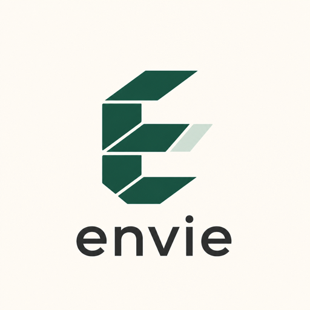

<p align="center">
  
</p>

# Examples

Paired folders measure how much an existing Terraform repo has to change to get Envie’s ephemeral environments.

```text
examples/<pattern>/
  01-vanilla/     # normal Terraform, no Envie
  02-envie/       # same infra after adding Envie
  ADOPTION.md     # files changed, friction, gaps
```

Write vanilla first, then add Envie. Prefer `envie adopt` over rewriting `.tf`.

| Example | Vanilla pattern | Friction |
|---------|-----------------|----------|
| [static-site](static-site/) | Flat single-root, `var.environment`, one S3 backend key | Drop-in |
| [workspaces-multi-env](workspaces-multi-env/) | `terraform.workspace` + `workspace_key_prefix` | Drop-in |
| [multi-stack-remote-state](multi-stack-remote-state/) | Two stacks, hand-written `terraform_remote_state` | Drop-in |
| [envs-per-directory](envs-per-directory/) | `envs/dev` and `envs/prod` copied from each other, shared `modules/` | Drop-in, deploy new environments one unit at a time |
| [partial-backend-config](partial-backend-config/) | Empty `backend "s3" {}`, `config/*.tfbackend` and `config/*.tfvars` per environment | Drop-in |
| [monorepo-scattered](monorepo-scattered/) | Roots at `platform/network` and `services/api/terraform` among application code | Drop-in |
| [full_backend](full_backend/) | Envie-native multi-unit serverless (no vanilla pair) | — |
| [api-output-export](api-output-export/) | Envie-native HTTP API + Lambda; `envie output` env/json/yaml then JS smoke tests | — |

In every pair, `02-envie` is `01-vanilla` plus `workspace.envie.yaml` and
`envie.yaml`. No `.tf` file differs, which is the point: if adoption needs you to
edit Terraform, that is a bug in Envie rather than a step in the guide.

Between them the pairs cover the ways an existing repository tends to be laid
out: one root or several, roots at a predictable path or scattered, environments
separated by state key, by Terraform workspace, or by copied directory, backends
written into the Terraform or supplied at `init`, and cross-stack reads wired by
hand. `tests/examples.rs` re-runs adoption on each `01-vanilla` and checks the
result still matches its `02-envie`.

All examples stay on free/cheap AWS (S3, DynamoDB on-demand, Lambda, API Gateway, SQS, IAM) in `eu-west-1`. Resource and bucket names start with `envie-test-`.

```bash
# Terraform only
cd examples/static-site/01-vanilla
terraform init -backend=false && terraform validate

# Envie plan (no apply)
cargo build --release
cd examples/static-site/02-envie
../../target/release/envie deploy --env pr-1 --dry-run
```

Wrap applies in `aws-vault exec personal --no-session --` and destroy in the same session.
